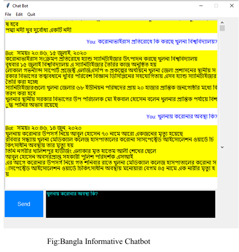

# 🇧🇩 Bangla Informative Chatbot (TF-IDF + Cosine Similarity)

A fully functional chatbot built for the **Bangla (Bengali) language** using **TF-IDF** and **Cosine Similarity**, implemented **entirely from scratch** (no NLP libraries like `scikit-learn`, `nltk`, etc.).  
The chatbot is trained on Bangla newspaper articles and responds to user queries with relevant sentences based on semantic similarity.

---

## 🔍 Features

- ✅ Bangla language support
- ✅ TF-IDF implementation from scratch
- ✅ Cosine Similarity without libraries
- ✅ Stopword removal
- ✅ Query matching with top-N ranked responses
- ✅ Clean command-line chatbot interface

---

## 📁 Dataset

The model expects a CSV of the newspaper data.

## 🖥️ Usage

### Screenshot of Chatbot in action

